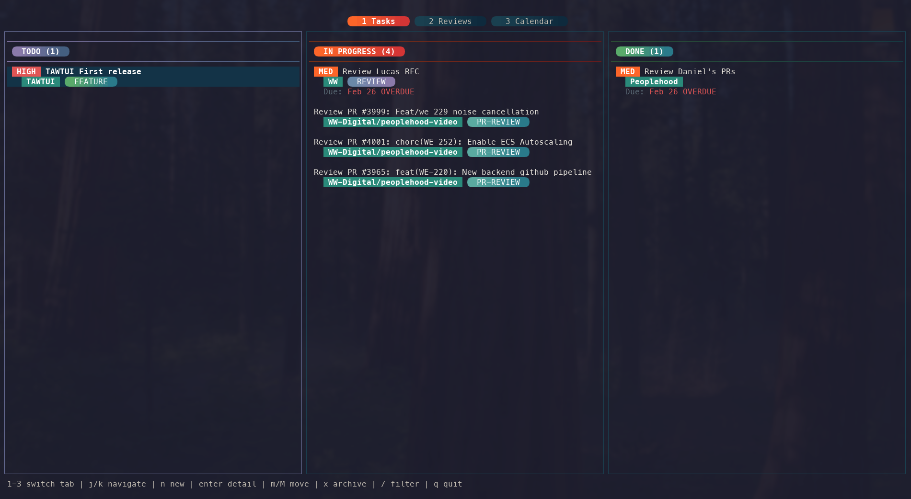
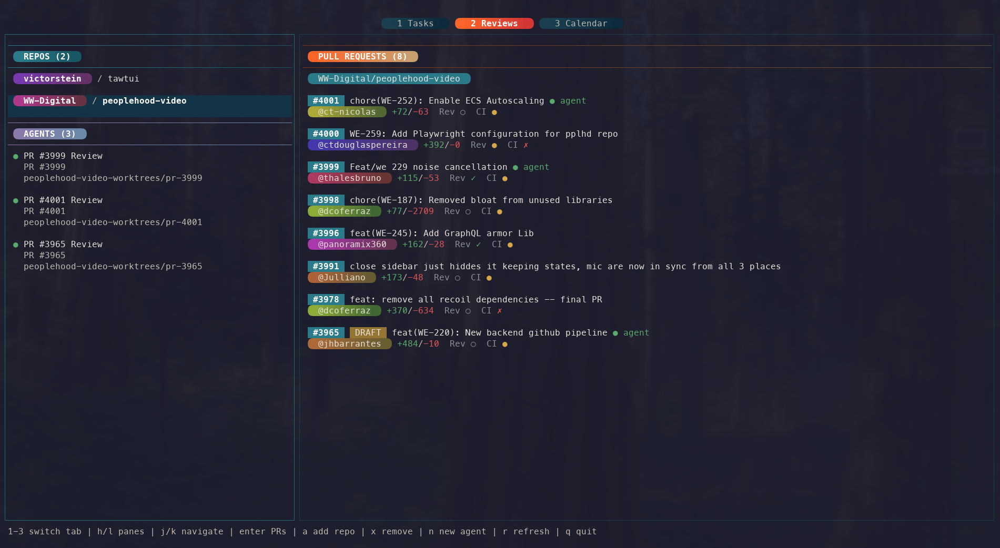
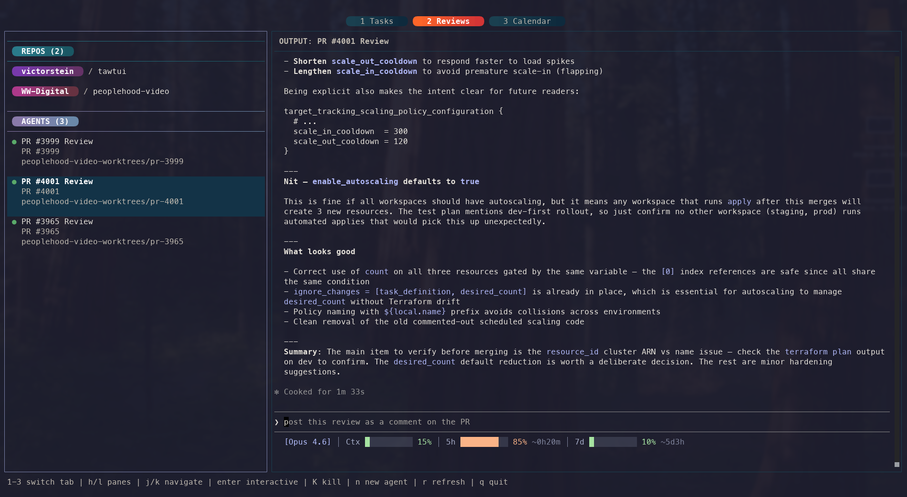
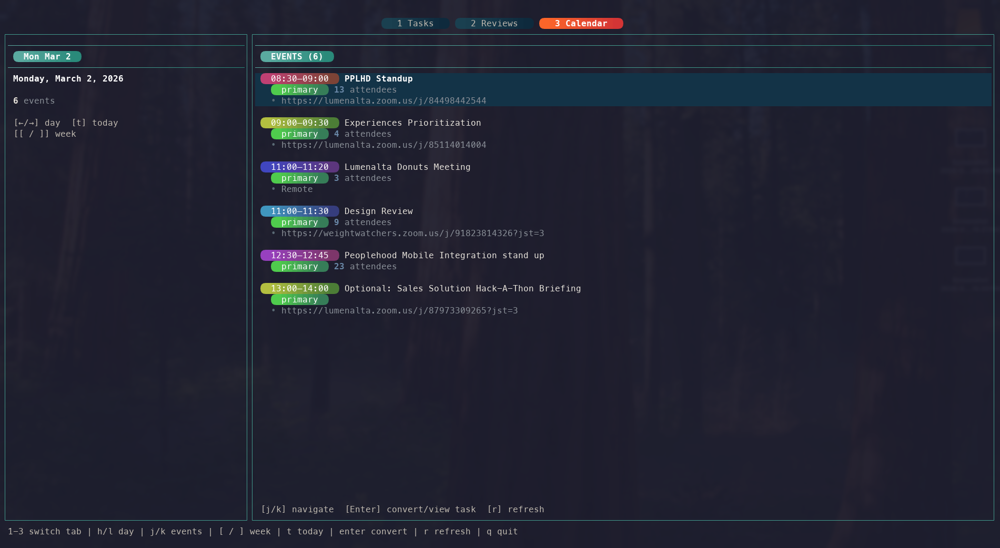

# tawtui

> A terminal UI that brings Taskwarrior, GitHub, and Google Calendar together.




## Features

### Task Board


Kanban-style board backed by Taskwarrior. Create, edit, filter, tag, and archive tasks across Todo, In Progress, and Done columns. Tasks show linked PRs, project names, and tags inline.

### PR Reviews



Browse pull requests across multiple GitHub repos. See status checks, labels, and agent review status at a glance.



Spawn AI coding agents (Claude Code, Codex, Gemini, and more) that review PRs in isolated git worktrees and post structured feedback directly to GitHub.

### Google Calendar



View upcoming Google Calendar events with color-coded labels and meeting links. Convert events into Taskwarrior tasks with a single keypress.

### Terminal Integration

Launch tmux sessions with git worktrees for isolated PR review workflows. Enter interactive mode to work directly in agent sessions.

## Installation

### Homebrew (recommended)

```sh
brew tap victorstein/tap
brew install tawtui
```

### Manual download

Download the binary for your architecture from [GitHub Releases](https://github.com/victorstein/tawtui/releases):

```sh
# Apple Silicon
curl -L https://github.com/victorstein/tawtui/releases/latest/download/tawtui-darwin-arm64 -o tawtui
# Intel
curl -L https://github.com/victorstein/tawtui/releases/latest/download/tawtui-darwin-x64 -o tawtui

chmod +x tawtui
mv tawtui /usr/local/bin/
```

## Prerequisites

| Tool | Required | Purpose |
|------|----------|---------|
| [Taskwarrior](https://taskwarrior.org/) (`task`) | Yes | Task storage and management |
| [GitHub CLI](https://cli.github.com/) (`gh`) | Yes | PR data and GitHub operations |
| [tmux](https://github.com/tmux/tmux) | Yes | Agent sessions and terminal multiplexing |
| [Google Calendar CLI](https://github.com/steipete/gogcli) (`gog`) | No | Calendar integration |

## Quick Start

```sh
tawtui
```

First launch triggers a setup wizard that checks for required dependencies and walks you through authentication.

## Keyboard Shortcuts

### Navigation

| Key | Action |
|-----|--------|
| `1` `2` `3` | Switch tab (Tasks, Reviews, Calendar) |
| `h` `l` / `Left` `Right` | Move between panes or columns |
| `j` `k` / `Down` `Up` | Navigate items in a list |
| `Enter` | Open detail / confirm |
| `Esc` | Cancel / go back |
| `r` | Refresh |
| `q` | Quit |

### Tasks

| Key | Action |
|-----|--------|
| `n` | New task |
| `m` / `M` | Move task forward / backward |
| `x` | Archive task |
| `/` | Filter (supports Taskwarrior filter syntax) |
| `A` | Toggle archive view |
| `u` | Unarchive task (in archive view) |
| `D` | Permanently delete (in archive view) |

### Reviews

| Key | Action |
|-----|--------|
| `a` | Add repository |
| `x` | Remove repository |
| `n` | New agent session |
| `K` | Kill agent |
| `i` | Enter interactive mode |
| `Ctrl+d` / `Ctrl+u` | Scroll terminal half-page |
| `g` / `G` | Jump to terminal top / bottom |
| `Esc Esc` | Exit interactive mode (double-press) |

### Calendar

| Key | Action |
|-----|--------|
| `Left` / `Right` | Previous / next day |
| `[` / `]` | Previous / next week |
| `t` | Jump to today |
| `Enter` | Convert event to task |

## Configuration

Configuration is stored at `~/.config/tawtui/config.json` and is created automatically on first run.

### Options

| Key | Description | Default |
|-----|-------------|---------|
| `repos` | GitHub repositories to track | `[]` |
| `preferences.defaultFilter` | Taskwarrior filter | `status:pending` |
| `preferences.archiveTime` | When to auto-archive done tasks | `midnight` |
| `agents.types` | Available AI coding agents | Built-in defaults |
| `projectAgentConfigs` | Per-repo agent and worktree settings | `[]` |
| `calendar.defaultCalendarId` | Google Calendar ID | `primary` |

## License

[MIT](LICENSE)
